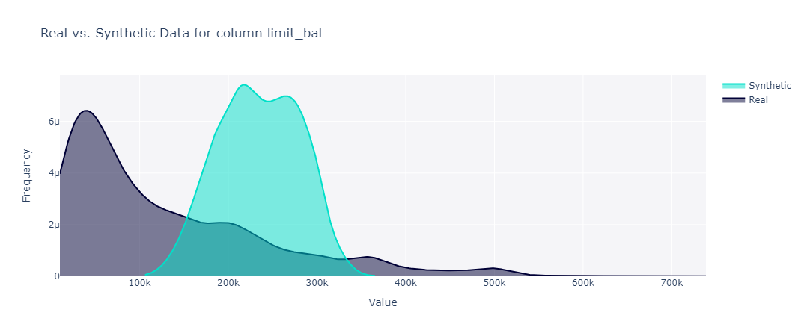
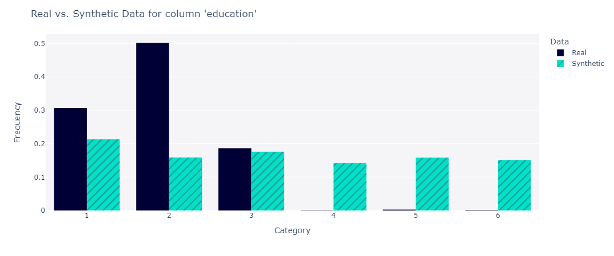

# Tabular data augmentation with score-based generative models 

## Important

**A large part of the code developed for this project is greatly inspirer by the [ncsn](https://github.com/ermongroup/ncsn) github repository.**

## Purpose 

The selected dataset is the [Default Payments of Credit Card Clients](https://www.kaggle.com/datasets/uciml/default-of-credit-card-clients-dataset) which contains information on default payments, demographic factors, credit data, history of payment, and bill statements of credit card clients in Taiwan from April 2005 to September 2005. This dataset is usually used in classification models in order to build payment default scoring models. 

However, the imbalanced class issue can make it difficult to build a scorer which correctly detects default payments. One solution to this problem is to synthetically generate data to increase the number of default payments. For this purpose we use **score-based generative modeling with multiple noise perturbations**. The main idea is to represent a distribution by modeling its score function, which can be estimated by training a score-based model of free-form architectures with score matching.

It consists in two steps: 

1. Learn score functions using **gradients of log probability density functions** on a large number of noise-perturbed data distributions
2. Generate samples with **Langevin-type sampling**

## Code 

### Architecture

The project architecture is as follows and the configuration files used in runners are in the [`configs/`](configs/) folder.

```
src/
├── loss/
├── runner/
├── data.py
├── model.py
├── sampling.py
└── utils.py
```

### Getting started

1. Clone the repository 

```
git clone 
cd tabular-sbgm
```

2. Setup environment

``` 
python -m venv\env
env\Scripts\activate
pip install -r requirements.txt
```

3. Download datasets [here](https://drive.google.com/drive/folders/1ScS8QD8X5e0yQ6EMCnmdguaDvI_dqO4R?usp=sharing)

4. Download model checkpoints [here](https://drive.google.com/drive/folders/1xnqoYJ8Vh3XTMcSmcPwS9jDdtQqOaorD?usp=sharing)

5. Open [`scorenet`](configs/scorenet.yaml) or [`anneal`](configs/anneal.yaml) and set the `mode` parameter to `eval`

6. Go to [`notebook`](notebook.ipynb) and follow the instructions.

## Theory

### Training 

The loss function used to train the score-based generator depends on the `algo` argument entered in [`config`](configs/): 

- `dsm` means we use the denoising score matching objective as loss function
- `ssm` means we use sliced score matching objective to greatly scale up the computation of score matching. 

One can also choose to add multiple noise perturbations with the [`anneal`](configs/anneal.yaml) configuration.

More details can be found [here](https://yang-song.net/blog/2019/ssm/). 

### Sampling 

Once the score-based model trained, we can use an iterative procedure called Langevin dynamics to draw samples from it. Langevin dynamics provides an MCMC procedure to sample from a distribution using only its score function.

### Data quality assessment

The quality score is the average between two general scores which are `Column Pair Trends` and `Column Shapes`. 

**`Column Pair Trends`**

It is the average between `ContingencySimilarity` ($s_{con}$) and `CorrelationSimilarity` ($s_{cor}$) scores. 

$$
s_{con} = 1 - \frac{1}{2} \sum_{\alpha \in A} \sum_{\beta \in B} |S_{\alpha, \beta} - R_{\alpha, \beta}|
$$

where $\alpha$ describes all the possible categories in column $A$ and $\beta$ describes all the possible categories in column $B$. $R$ and $S$ refer to the real and synthetic frequencies for those categories.

If the contingency table is exactly the same between the real vs. synthetic data, then $s_{cor}=1$. The more different the contingency tables, the closer $s_{con}$ to 0. 

$$
s_{cor} = 1 - \frac{1}{2} |S_{A, B} - R_{A, B}|
$$

The pairwise correlations of the real and synthetic data are exactly the same if $s_{cor} = 1$. The more different the pairwise correlations, the closer $s_{cor}$ to 0. 

**`Column Shapes`**

This score is computed as the average between the `KSComplement` and `TVComplement` scores which computes the similarity of a real column vs. a synthetic column in terms of the column shapes (marginal distributions). 

The `KSComplement` score uses the Kolmogorov-Smirnov statistic to compare the distributions of the two continuous columns using the empirical CDF. It returns 1 minus the KS Test D statistic, which indicates the maximum distance between the expected CDF and the observed CDF values.

`TVComplement` is the Total Variation Distance (TVD) between the real and synthetic columns. It first computes the frequency of each category value and expresses it as a probability. The TVD statistic compares the differences in probabilities, as shown in the formula below.

$$
\delta(R, S) = \frac{1}{2} \sum_{\omega \in \Omega} |R_{\omega} - S_{\omega}|
$$

where $\omega$ describes all the possible categories in a column $\Omega$. The `TVComplement` score is:

$$
s_{TV} = 1 - \delta(R, S)
$$

## Results 

### Quality score report

The following report and figures are related to data generated with the `ScoreNet` model with `dsm` loss function. 

```python 
Creating report: 100%|██████████| 4/4 [00:07<00:00,  1.86s/it]

Overall Quality Score: 52.35%

Properties:
Column Shapes: 39.62%
Column Pair Trends: 65.07%
```

<p float="left">
  
   
</p>

The following table shows classification results obtained when training `LogisticRegression` classifier on the original training set vs. augmented training set (sampled from `ScoreNet` model with `dsm` loss function and Langevin sampling). 

```python
              Classification Report (test)               
┏━━━━━━━━━━━━━━━━━━━━━━┳━━━━━━━━━━━━━━━┳━━━━━━━━━━━━━━━━┓
┃ Metric               ┃ Original Data ┃ Augmented Data ┃
┡━━━━━━━━━━━━━━━━━━━━━━╇━━━━━━━━━━━━━━━╇━━━━━━━━━━━━━━━━┩
│ No Default precision │ 0.82          │ 0.821          │
│ No Default recall    │ 0.971         │ 0.971          │
│ No Default f1-score  │ 0.889         │ 0.89           │
│ Default precision    │ 0.698         │ 0.702          │
│ Default recall       │ 0.24          │ 0.244          │
│ Default f1-score     │ 0.357         │ 0.363          │
│ accuracy             │ 0.811         │ 0.811          │
└──────────────────────┴───────────────┴────────────────┘
```

## Resources

### Github

- [deep_tabular_augmentation](https://github.com/lschmiddey/deep_tabular_augmentation)
- [ncsn](https://github.com/ermongroup/ncsn)
- [SDV](https://github.com/sdv-dev/SDV)

### Datasets
- [Default Payments of Credit Card Clients](https://www.kaggle.com/datasets/uciml/default-of-credit-card-clients-dataset)
- [credit-dataset](https://github.com/Giskard-AI/giskard-client/blob/main/sample_data/classification/credit/german_credit_prepared.csv)

### Articles

- [Generative Modeling by Estimating Gradients of the Data Distribution](https://arxiv.org/abs/1907.05600)

### Blogs

- [Generative Modeling by Estimating Gradients of the Data Distribution](https://yang-song.net/blog/2021/score/#naive-score-based-generative-modeling-and-its-pitfalls)
- [Sliced Score Matching: A Scalable Approach to Density and Score Estimation](https://yang-song.net/blog/2019/ssm/)
